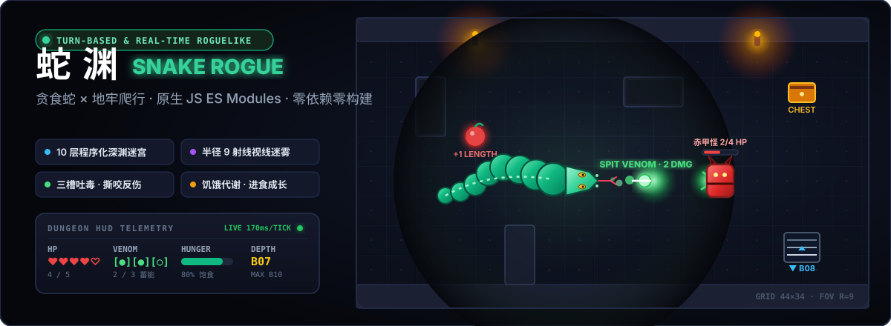

<p align="center">
  
</p>

<p align="center">
  <a href="https://holynova.github.io/snake-rogue/"></a>
  
  
  
  <a href="LICENSE"></a>
</p>

<p align="center">
  <b>经典的贪食蛇躯体动力学与深渊 Roguelike 地牢爬行的致命碰撞。</b><br>
  在幽暗压抑的十层地下城中，利用逐格游走、喷吐毒液、蛇躯卡位与进食代谢，斩除魔物并寻获远古圣物！
</p>

---

## 🎮 在线试玩

- **网页端即开即玩**：[https://holynova.github.io/snake-rogue/](https://holynova.github.io/snake-rogue/)
- **手机扫码直达**：

<p align="center">
  
</p>

---

## ⚔️ 游戏实机

<p align="center">
  
</p>

---

## 💡 核心设计与玩法机制

### 1. 身体即屏障与进食代谢
- **变长与成长**：初始身为 3 节。每吞食一颗地牢苹果，蛇身延长 1 节（上限 40 节），增加分数并回复 30 点饱食度。
- **饥饿惩罚**：蛇的新陈代谢持续运转（每 4 tick 消耗 1 点饱食度）。一旦饥饿归零，角色每 9 tick 将承受 1 点不可避免的衰竭伤害。
- **物理体积占位**：蛇身不仅是玩家自身的运动路径，**在所有地牢敌人眼中均被判定为不可穿越的实体障碍物**。善用蜿蜒走位可制造防线、分割战场或诱导敌人绕远路。

### 2. 双模态战斗：近战撕咬与毒液吐息
- **近战撕咬（Bite）**：蛇头主动撞向相邻敌人发动攻击，固定造成 1 点物理伤害。
  - **斩杀吞噬**：若目标生命归零，蛇将立即吃掉敌人，身长 +1 并获得对应积分，同时有 **28% 几率掉落新鲜苹果**。
  - **反伤与击退**：若敌人未死亡，玩家受到敌人反咬伤害（1 HP），并将敌人沿前进轴线向后击退 1 格。
- **远程毒液吐息（Spit Venom · 空格键）**：
  - 拥有 3 格毒液蓄能槽，每次喷射消耗 1 槽。
  - 毒液沿当前面朝方向高速飞跃至多 6 格，对命中的首个敌人造成 **2 点致命毒素伤害**（可直接秒杀毒蛛与残血魔物）。
  - 毒液随时间自动代谢充能（每 40 tick / 约 6.8 秒自动回复 1 格），亦可通过地牢中的蓝色药水或神秘宝箱瞬间补满。

### 3. 程序化地牢生成（Procedural Dungeon）
- **10 层深渊架构**：地牢共设 10 层，难度随深度递增。下潜至第 10 层（B10）夺取**古代圣物（Ancient Amulet, +500 分）**方可逃出蛇渊通关。
- **房间与连通算法**：每层基于伪随机数发生器（PRNG）生成 7 至 11 个互不重叠的独立矩形大厅，并通过自适应曼哈顿 L 型通道完全连通。
- **地牢交互元素**：
  - **宝箱（Chest）**：开启可随机爆出治疗药水、全满毒液、巨额金币或远古血肉（身长 +2）。
  - **地刺陷阱（Traps）**：踏入即遭受 1 点穿刺伤害。
  - **药水与金币**：红药水回复 1 点生命（满血转化为分数），蓝药水回满毒液，金币增加得分。
  - **永久死亡（Permadeath）**：单局生命清零即宣告阵亡，本地 `localStorage` 自动记录生涯最高分。

### 4. 视线迷雾与动态视野（Raycasting FOV）
- **视野算法**：采用基于 Bresenham 直线光追的视线阻挡算法（Line-of-Sight, 半径 R = 9 格）。
- **两级探索迷雾**：
  - **高亮视野区**：蛇头直视范围内的地块与所有实体（敌人、道具、陷阱）实时渲染。
  - **已探索记忆区**：曾照亮过的房间结构与地砖保留暗调记忆，便于战术路径规划。
  - **未知虚空**：未曾涉足的深渊区域呈现纯黑，隐藏着致命危险。

### 5. 敌人图鉴与 BFS 寻路 AI
所有敌人均具备基于广度优先搜索（BFS）的最短路径追踪逻辑，并将蛇身作为固体墙壁绕行逼近：

| 魔物名称 | 图块 | 基础生命 | 行动频率 | 攻击伤害 | 游荡几率 | 战术特征 |
| :--- | :---: | :---: | :---: | :---: | :---: | :--- |
| **毒蛛 (Spider)** | 🕷️ | 1 HP | 每 2 步 | 1 DMG | 45% | 敏捷脆弱，游荡率高，常在走廊阻碍路线，喷毒一击必杀 |
| **狂徒 (Zombie)** | 🧟 | 2 HP | 每 2 步 | 1 DMG | 20% | 步步紧逼的近战步兵，咬击反伤需谨慎对付 |
| **怨灵 (Ghost)** | 👻 | 2 HP | **每 1 步** | 1 DMG | 12% | 极高行动速度，直冲蛇头，地牢中的致命突袭者 |
| **赤甲怪 (Demon)**| 👹 | **4 HP** | 每 2 步 | **2 DMG** | 15% | 深渊守卫，血厚攻高，建议拉开距离配合毒液射击消耗 |

### 6. 操作缓冲与防卡死保护
- **撞墙停驻（Stalled）**：蛇头正面撞墙不会暴毙或扣血，蛇暂停前进，但**地牢时间与怪物依然在实时流逝**，需迅速调整方向脱困。
- **多步输入缓冲**：支持最多 3 步方向键预缓冲，即便在高速 170ms 步进下也能精准转弯。
- **安全后退/掉头机制**：允许向后 180° 输入——只要蛇尾后方是合法地面且无敌人，整条蛇身将优雅后撤，化解死胡同卡位危机。

---

## 🕹️ 操作指南

| 按键 | 对应动作 | 说明 |
| :--- | :--- | :--- |
| <kbd>W</kbd> <kbd>A</kbd> <kbd>S</kbd> <kbd>D</kbd> / 方向键 | **移动与转向** | 实时网格移动，支持多步缓冲与合法后退掉头 |
| <kbd>Space</kbd> 空格键 | **喷吐毒液** | 消耗 1 格毒液槽，远程打击 6 格直线敌人（2 伤害） |
| <kbd>P</kbd> / <kbd>Esc</kbd> | **暂停游戏** | 暂停地牢时钟与怪物演算 |
| <kbd>M</kbd> | **静音切换** | 开启 / 关闭地牢背景音乐与音效 |
| <kbd>Enter</kbd> | **开始 / 确认** | 游戏开始界面确认 |
| <kbd>R</kbd> | **重新开始** | 死亡或通关后重新生成第 1 层地牢 |

---

## 🛠️ 技术栈与架构

- **语言核心**：原生 JavaScript（ES Modules），无打包构建步骤，浏览器直接解释执行。
- **渲染引擎**：原生 HTML5 `Canvas2D` API，双缓冲高帧率粒子爆裂与平滑插值渲染。
- **音效系统**：Web Audio API 实时音频管线，支持多音轨音效混音与循环 BGM。
- **数据存储**：HTML5 `localStorage` 本地最高分持久化。
- **开源素材（全部 CC0 授权）**：
  - 地牢与敌人图块：[Kenney — Tiny Dungeon](https://kenney.nl/assets/tiny-dungeon)
  - 战斗与交互音效：[Kenney — RPG Audio](https://kenney.nl/assets/rpg-audio)
  - 背景音乐：[8-bit Perilous Dungeon](https://opengameart.org/content/8-bit-perilous-dungeon)
  - 蛇躯、道具粒子与战术 HUD：完全由 Canvas 代码程序化生成。

---

## 🚀 本地运行

因项目全面采用 ES Modules 模块化架构，浏览器出于安全策略（CORS）禁止通过 `file://` 协议直接加载，需通过任意本地 HTTP 服务器启动：

```bash
# 方式 1：使用仓库内置 Node.js 服务器
npm start
# 浏览器访问 http://localhost:8080

# 方式 2：使用 npx serve
npx serve .

# 方式 3：使用 Python 快速启动
python3 -m http.server 8080
```

---

## 📄 开源许可证

本项目基于 [MIT License](LICENSE) 自由开源。
欢迎 Star、Fork 以及提交 Pull Request 共同完善深渊挑战！
