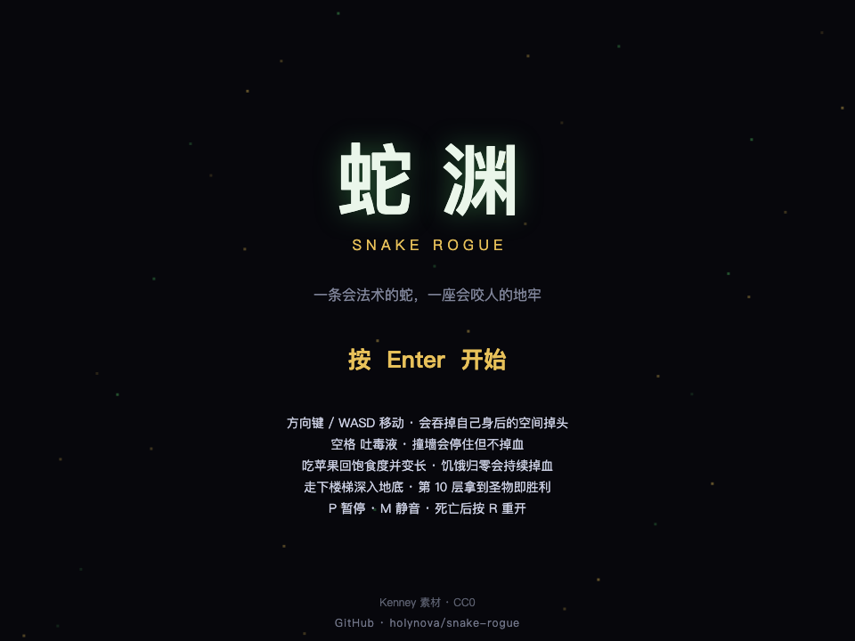
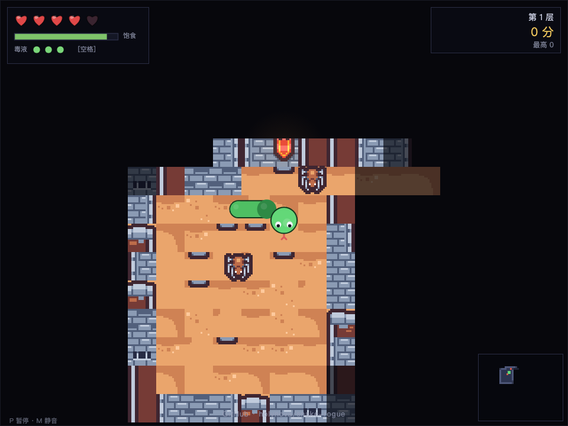

# 蛇渊 · Snake Rogue

贪食蛇 × Roguelike 网页游戏。实时逐格移动、咬击与毒液战斗、饥饿系统、FOV 迷雾 + 小地图、10 层地下城夺宝逃生。原生 JS ES Modules + Canvas2D，零依赖、无构建步骤。

**在线试玩**：<https://holynova.github.io/snake-rogue/>
**源码仓库**：<https://github.com/holynova/snake-rogue>

手机扫码直接打开：






## 本地运行

```bash
npm start   # 打开 http://localhost:8080
```

## 操作

方向键 / WASD 转向（可掉头）· 空格 吐毒液 · P 暂停 · M 静音 · Enter 开始 · R 重开

撞墙停住不掉血；吃苹果长身体回饥饿；第 10 层拿到圣物即胜利。死亡后按 R 重开，自动记录最高分。

## 素材与许可

地图/音效：Kenney（Tiny Dungeon、RPG Audio，CC0）；BGM：8-bit Perilous Dungeon（CC0）。蛇、苹果、金币、圣物为程序化绘制。代码 MIT。
