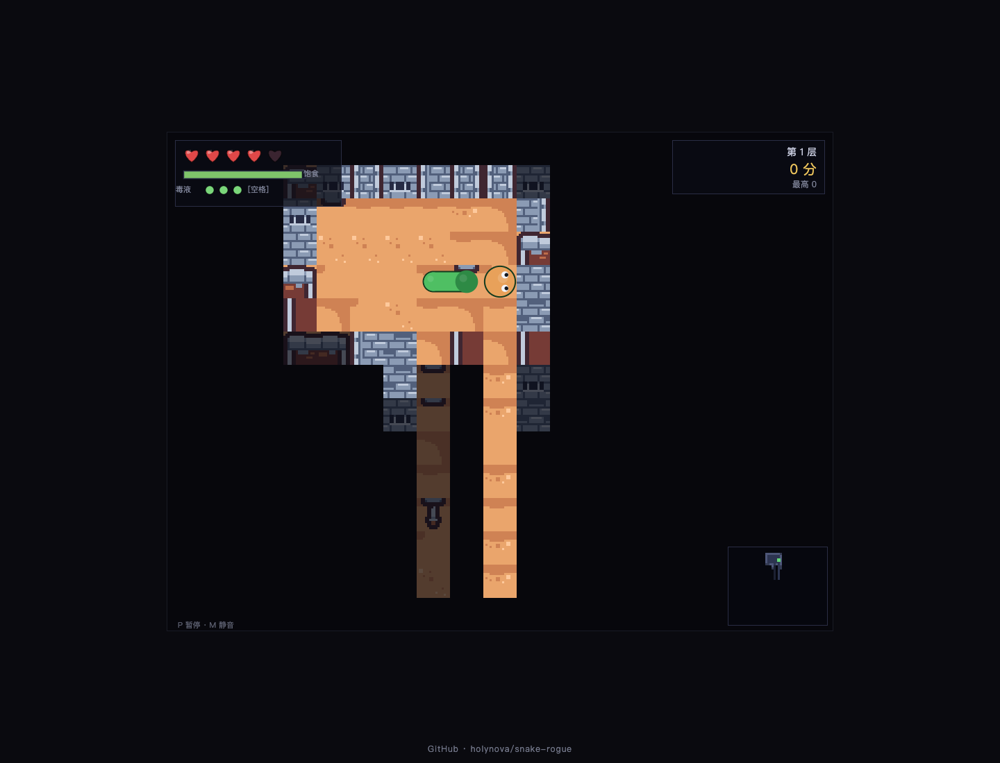

# 蛇渊 · Snake Rogue

在带视线迷雾的网格地牢中移动、进食、喷吐毒液，寻找地下遗物。

A grid-based snake dungeon crawler with fog of war, venom attacks and hunger management.

[在线体验](https://snake-rogue.xiaosang.cc/) · [源码](https://github.com/holynova/snake-rogue)



## 可以做什么

- 利用蛇身卡位，用毒液处理前方敌人。
- 管理饱食度与生命，穿过程序化房间。

## 怎么玩

WASD / 方向键移动，Space喷毒，Enter开始，P / Esc暂停，M静音，R重新开始。

## 本地运行

```bash
npm start
```

打开 http://localhost:8080/。原生JavaScript模块通过HTTP运行，无需打包。


## 发布

```bash
npx --yes wrangler@4.128.0 deploy --dry-run --config wrangler.jsonc
npx --yes wrangler@4.128.0 deploy --config wrangler.jsonc
```

从 `master` 同一提交在本地手动发布到Cloudflare Workers。正式地址：[https://snake-rogue.xiaosang.cc/](https://snake-rogue.xiaosang.cc/)。

游戏图块与音效使用Kenney Tiny Dungeon / RPG Audio；背景音乐素材保留在 `assets/`，使用前请阅读相应素材的授权文件。
