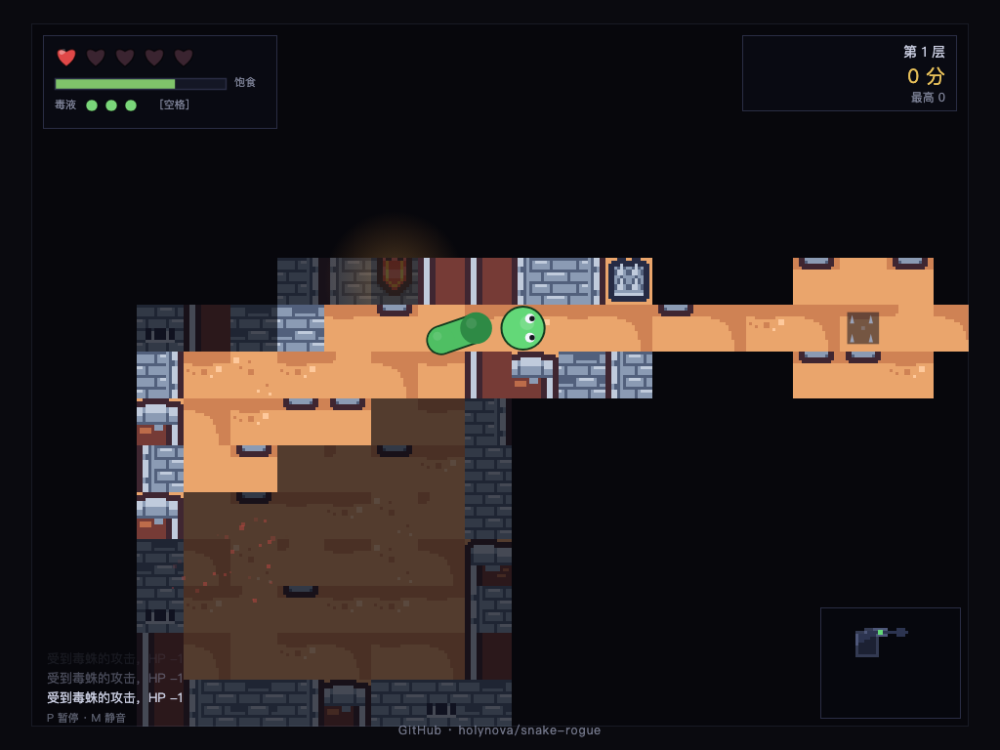

# 蛇渊 · Snake Rogue

贪食蛇 × Roguelike 网页游戏。原生 JS ES Modules + Canvas2D，零依赖、无构建步骤。



## 在线游玩

- GitHub Pages：<https://holynova.github.io/snake-rogue/>
- 扫码直达：


## 本地运行

```bash
npm start
# 打开 http://localhost:8080
```

ES Modules 必须经 HTTP 访问，不能直接 file:// 打开。

## 操作

| 按键 | 作用 |
| --- | --- |
| 方向键 / WASD | 转向（可缓冲多步，允许掉头） |
| 空格 | 吐毒液（3 槽，随时间回复） |
| P / Esc | 暂停 |
| M | 静音 |
| Enter | 开始 / 确认 |
| R | 死亡后重开 |

## 玩法

- 实时逐格移动，撞墙停住（不掉血，但敌人仍在行动）。
- 头咬敌人：击杀 → 吃掉 +1 身长 + 分；未死 → 反伤 + 击退。
- 敌人把蛇身当实体障碍，绕行逼近。
- 吃苹果长身体、回饥饿；饥饿归零周期掉血。
- 半径 9 视线遮挡 + 已探索变暗记忆 + 小地图。
- 共 10 层，第 10 层拿圣物逃出生天。永久死亡，记录最高分。

## 素材（全部 CC0）

- 地牢图块：[Kenney — Tiny Dungeon](https://kenney.nl/assets/tiny-dungeon)
- 音效：[Kenney — RPG Audio](https://kenney.nl/assets/rpg-audio)
- BGM：[8-bit Perilous Dungeon](https://opengameart.org/content/8-bit-perilous-dungeon)（CC0）
- 蛇、苹果、金币、圣物为程序化绘制。

## 项目地址

<https://github.com/holynova/snake-rogue>
